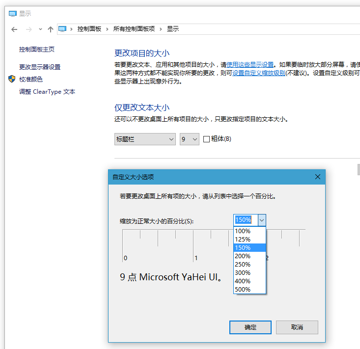
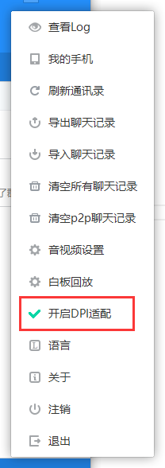

# 网易云信 高分屏功能升级说明

## <span id="云信高分屏功能简介">云信高分屏功能简介</span>

`高分屏`简单来说就是高分辨率屏幕，分辨率越高则显示器上单位面积显示的像素点越多，所以分辨率越大，则显示器显示的内容就越小、越多。近几年高分屏设备越来越普及，新一代笔记本几乎都是高分屏，最新版本的操作系统也都加强了对高分屏的支持。但与此同时也有个麻烦的问题，就是由于分辨率太高导致显示的内容很小，进而操作起来会比较麻烦，这点在平板电脑上尤为显著。

为了解决这个问题，我们可以设置系统`DPI缩放比例`。在Windows系统的控制面板里修改缩放比例来放大系统整体界面，这样我们就可以得到放大后的界面效果。


设置了DPI之后，如果我们的程序没有自己处理DPI缩放信息，则系统会自动帮助我们根据DPI来缩放程序。但是系统的缩放，实际就是获取程序原本尺寸的位图，然后根据DPI放大后显示出来，所以就会导致放大后的效果比较模糊。而如果我们的程序可以自己处理DPI缩放信息，系统就不会自动管理我们的程序，程序内部自己根据DPI来放大程序，那么就可以得到很清晰的界面效果。程序自己处理DPI的过程就是`DPI适配`。

现在开发PC客户端很有必要考虑对`高DPI`的支持。微软自己推出的软件普遍对高DPI支持的很好，但是当前国内很多PC客户端对高分屏的支持力度不够。如果软件本身不支持高DPI而用户设置了高DPI，反而会让软件变得模糊。`云信Duilib`对整体代码进行改造后，`云信3.5版本`已经初步支持了`高DPI`适配。本文就是关于如何把旧版本的`云信Demo`升级为支持`高DPI`功能新Demo的说明文档。

## <span id="开启高DPI适配">开启高DPI适配</span>

在初始化Duilib时，为Startup函数的第三个参数传入bool值，可以设定Duilib是否开启`DPI适配`。另外在`云信Demo3.5`版本里，主界面的菜单里有选项来设置是否适配DPI。DPI的设置需要重启程序生效。

```
	bool adapt_api = ConfigHelper::GetInstance()->IsAdaptDpi();
	ui::GlobalManager::Startup(theme_dir + L"themes\\default", ui::CreateControlCallback(), adapt_api, language);
```



## <span id="Duilib新增的接口">Duilib新增的接口</span>

Duilib新增了`DpiManager`类来统一管理DPI缩放，其中提供了`SetScale`、`ScaleSize`、`ScalePoint`、`ScaleRect`等接口，会把传入的数据根据当前的DPI缩放比例来缩放，方便我们得到缩放后的数据

Duilib的`Window::SetPos`函数修改了参数，第二个参数`bNeedDpiScale`代表调用SetPos函数时，传入的窗口尺寸，是否需要经过DPI缩放。如果传入的窗口尺寸，并没有经过DPI缩放计算，则`bNeedDpiScale`应该传入true

```
void SetPos(const UiRect& rc, bool bNeedDpiScale, UINT uFlags, HWND hWndInsertAfter = NULL, bool bContainShadow = false);
```

## <span id="需要修改的代码">需要修改的代码</span>

为了让老版本代码支持Duilib的`DPI适配`功能，需要修改一下Demo层的部分代码，Demo层中涉及到设置窗口尺寸的代码，都需要修改一下代码。

- `nim_demo`项目中`main.cpp`文件中`MainThread::Init()`函数里初始化Duilib时，修改初始化函数`ui::GlobalManager::Startup`的参数，开启Duilib的DPI适配功能


- 以下地方，调用`SetPos`函数的代码，`bNeedDpiScale`参数填写为false
	1. `shared`项目中菜单控件`ui_menu.cpp`文件中`CMenuWnd::Show`函数
	2. `ui_kit`项目中`team_callback.cpp`文件中`TeamNotifyForm* GetTeamNotifyForm`函数
	3. `ui_kit`项目中`link_form.cpp`文件中`ShowLinkForm`函数
	4. `ui_kit`项目中`emoji_form.cpp`文件中`EmojiForm::ShowEmoj`函数
	5. `ui_kit`项目中`at_list_form.cpp`文件中`AtlistForm::SetShowPos`函数
	6. `ui_kit`项目中`screen_capture_tool.cpp`文件中`ScreenCaptureTool::InitWindow`函数
	7. `ui_kit`项目中`drag_form.cpp`文件中`DragForm::LowLevelMouseProc`函数
	8. `ui_kit`项目中`drag_form.cpp`文件中`DragForm::CreateDragForm`函数
	9. `ui_kit`项目中`session_manager_dragdrop.cpp`文件中`SessionManager::OnAfterDragSessionBox`函数


- 以下地方，调用`SetPos`函数的代码，`bNeedDpiScale`参数填写为true
	1. `ui_kit`项目中`session_form.cpp`文件中`SessionForm::AdjustFormSize`函数
	2. `ui_kit`项目中`video_form_ui.cpp`文件中`VideoForm::AdjustWindowSize`函数
	3. `ui_kit`项目中`session_manager_dragdrop.cpp`文件中`SessionManager::SetEnableMerge`函数
	4. `image_view`项目中`image_view_form.cpp`文件中`ImageViewForm::StartViewPic`函数


- 以下地方，参考云信Demo3.5版本来修改代码，涉及到缩放窗口尺寸
	1. `ui_kit`项目中`bubble_notify.cpp`文件中`MsgBubbleNotice::OnResized`函数
	2. `ui_kit`项目中`bubble_text.cpp`文件中`MsgBubbleText::EstimateSize`函数
	3. `ui_kit`项目中`session_box_ui.cpp`文件中`SessionBox::OnBtnEmoji`函数
	4. `ui_kit`项目中`richedit_util.cpp`文件中`Re_InsertFace`函数


## <span id="未完成的功能">未完成的功能</span>

我们现在的Duilib开启DPI适配后，会根据DPI缩放比例，来缩放字体，绘制图形的尺寸。但是还不支持适配多套DPI素材（即根据DPI值去加载不同尺寸的素材，这些素材需要提前做好），未来会考虑增加此功能的支持