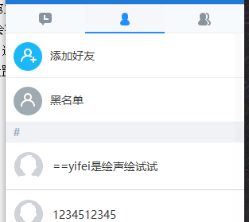
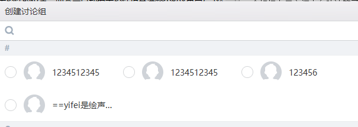
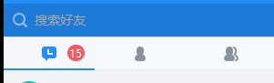
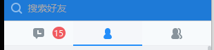

# 网易云信 DuiLib 布局功能指南

## 云信DuiLib 布局模块简介

* `云信Duilib`与原版Duilib相比，控件属性和XML布局方法有较大的不同点。`云信Duilib`的布局系统更加灵活和简单，可以轻松的完成许多原本Duilib较难实现的布局功能，但是他们在总体思路上是相同的，所以也建议学习一下原版Duilib的使用方法。[原版Duilib布局介绍](http://blog.csdn.net/zhuhongshu/article/details/38531447)
* 原版Duilib提供了属性列表。我们也提供了类似的`云信Duilib`的控件属性列表[云信Duilib属性列表](./duilib属性列表.xml)，里面包含了所有控件的属性的介绍，在编写XML布局时需要经常查询属性列表。 
* `云信Duilib`并没有设计器，需要手工编写XML文件，使用常见的文本编辑器就可以，比如`Sublime`、`notepad`。

## 各个布局控件介绍

布局控件包括:`Box`、`VBox`、`HBox`、`TabBox`、`TileBox`、`ChildBox`、`ListBox`、`HListBox`、`VListBox`;`LabelBox`、`ButtonBox`、`OptionBox`、`CheckBoxBox`。

其中Box对应原版Duilib的`Container`，HBox对应`HorizaontalLayout`，VBox对应`VerticalLayout`，TabBox对应`TabLayout`、TileBox对应`TileLayout`，ChildBox对应`ChildLayou`t。

VListBox对应`List`。`ListBox、HListBox、LabelBox、ButtonBox、OptionBox、CheckBoxBox`属于新增布局，原版Duilib不存在。其中LabelBox、ButtonBox、OptionBox、CheckBoxBox布局相当于Label、Button等控件与Box控件的结合体，他们具有原控件的外观和功能，同时也可以作为容器来使用。

### Control控件布局属性介绍

Control是`云信Duilib`的最基础控件，也是所有其他控件的基类。首先介绍一下所有控件的通用布局属性，这在`云信Duilib`中非常频繁被使用。这些属性包括：`margin`、`widt`h、`height`、`float`、`halign`、`valign`。其中margin、width、height三个属性在任何布局中都有效，halign、valign属性在只有控件开启了float属性时才有效。Box布局把所有子控件都认为开启了float属性，其他布局不会。

##### width、height属性
这两个属性用于设置控件的宽度和高度，与原版Duilib不同的是：新增加了`stretch`、`auto`两个属性值，控件width、height属性默认的属性值为`stretch`。当属性值为`stretch`时，代表由父容器计算本控件宽或者高，并且尽量填充满父容器；当属性值为`auto`时，代表本控件会根据控件内容自动计算本控件的宽或者高（比如对于文本内容，可以文本的长度来自动设置控件的宽度；对于图片内容，可以根据图片的尺寸来自适应控件的尺寸），使用了`auto`属性值后，对于很多要设置自身尺寸为图片尺寸的控件来说会省去许多麻烦。

对于Label控件，width、height属性默认的属性值为`auto`，会自动根据文本内容自适应控件宽高。

对于Box等容器控件，如果width、height属性设置为`auto`，容器就会根据所有子控件的尺寸来自适应自己的尺寸。很经典的例子就是`云信Demo`的登录窗口，窗口最外层布局的height属性设置为`auto`，所以登录窗口的高度是根据子控件自适应的。而所有子控件的总高度可能因为切换到注册页面而改变，所以这个时候登录窗口的高度就会自动跟着改变。有了这个属性后，就完全不需要我们通过代码来设置登录窗口的高度，它可以自适应高度。

##### margin属性
margin属性相当于原本Duilib中的`padding`属性，也就是外边距属性，在做相对布局时，经常需要设置此属性值来调整本控件与其他控件之间的边距

##### float属性
float属性默认是关闭的，用于所浮动布局(相对于原本Duilib的绝对布局的叫法、在这里称为浮动布局更合适)。开启了float属性后，控件的位置就不受父容器控件的布局功能影响了，配合halign、valign、margin三个属性，可以做出非常灵活的布局效果。因为valign、margin属性的加入，让float的浮动布局功能比原版的Duilib的float绝对布局功能大大增强。

##### halign属性
当开启了float属性，或者父容器为Box控件时，这个属性有效。这个属性可以指定left、center、right中的一种，作用是设置控件的横向位置。使用了这个属性以后，方便我们在不知道父容器具体大小的情况下，就可以指定控件的横向位置。

##### valign属性
当开启了float属性，或者父容器为Box控件时，这个属性有效。这个属性可以指定top、center、bottom中的一种，作用是设置控件的纵向位置。
halign、valign、margin三个属性配合，可以灵活的在界面上把某个控件悬浮到某个位置。比如会话窗口中使用Box配合valign属性属性把`aduio_capture_view`、`at_me_view`对应的`语音录制`和`@me提示`贴到聊天框上面

### Box布局

Box是所有布局容器的基类，也是经常会被使用的布局。Box布局的最基本功能是：让所有子控件依次叠加显示出来。与原版Duilib的Container最大不同在于，他会根据子控件的margin、width、height、halign、valign属性来定位子控件的位置，而不会自动把子控件填充满整个Box布局(当然如果需要的话也可以填充满)。在云信Demo的XML中经常会看到Box配合子控件的halign、valign属性来一起布局。

所有布局用的容器控件都拥有`padding`、和`childmargin`属性。

##### padding属性
padding属性相当于原版Duilib中的`inset`属性，也就是内边距属性，

##### childmargin属性
childmargin属性相当于原版Duilib中的`childpadding`属性，也就是子控件之间的额外间距。各个子控件之间可以通过margin属性设置外边据，同时容器控件通过childmargin属性可以指定各个子控件在排版时的额外间距。

Box控件的childmargin属性是无效的。对于其他布局，不同的布局childmargin属性的作用不一样。比如对于VBox布局用于指定子控件纵向排列的额外间距，对于HBox布局用于指定子控件横向排列的额外间距。

### VBox布局
VBox布局对应原版Duilib的`VerticalLayout`，他会自动让所有非float状态的子控件依次纵向排列。如果子控件的height属性指定为`stretch`，则会根据布局空间去自动计算子控件应有的高度。VBox布局不会影响子控件的宽度。

### HBox布局
HBox布局对应原版Duilib的`HorizaontalLayout`，他会自动让所有非float状态的子控件依次横向排列。如果子控件的width属性指定为`stretch`，则会根据布局空间去自动计算子控件应有的宽度。HBox布局不会影响子控件的高度。

### TabBox布局
TabBox布局对应原版Duilib的`TabLayout`，是一个分页布局控件，可以包含多个页面，并且切换显示其中的某一个页面。同一时间只能由一个页面被显示。云信Demo主界面的各个列表页面的切换就是使用TabBox布局


TabBox布局拥有`fadeswitch`、和`selectedid`属性。

##### fadeswitch属性
fadeswitch属性可以指定当切换页面时是否使用动画效果，默认不使用动画效果

##### selectedid属性
selectedid属性可以指定默认选中的页面id

### TileBox布局
TabBox布局对应原版Duilib的`TileLayout`，平铺布局可以做类似系统桌面平铺桌面图标的效果，云信Demo的联系人选择器中每个分类的联系人就是使用TilbeBox平铺布局


TileBox布局拥有`columns`、和`itemsize`属性。这两个属性冲突、不能同时使用

##### columns属性
columns属性可以来设置每行中包含的列数，他会自动把包含的元素从左到右从上到下按照columns属性的设置排列起来，每行的列数是固定的。

##### itemsize属性
itemsize属性会设置每个元素所占的区域，比如容器的宽度是500，给itemsize设置为 100 x 10，那个每行就会容纳5个元素，当我们拉伸了窗体让容器宽度变为700，那么每行就会自动容纳7个元素，这意味着使用这个属性会让每行容纳的元素个数是自动可变的。

### ChildBox布局
ChildBox布局对应原版Duilib的`ChildLayout`，ChildBox布局比较少用，他的作用就是从一个XML文件中加载布局来嵌入到ChildBox布局所在的地方，设置xmlfile属性来指定XML文件位置就可以。他的意义在于可以把繁杂的大量XML代码分隔开。比如他和TabBox布局结合，让TabBox布局包含5个ChildBox布局，而每个ChildBox布局分别从5个XML文件加载自己的布局文件，这样就可以分块化的编写布局代码。ChildLayout不可以识别XML中的自定义控件

### ListBox、HListBox、VListBox布局
ListBox布局对应原版Duilib的`List`控件，严格来说他不是布局而是列表控件。ListBox、HListBox、VListBox三个都是列表控件他们的区别在于他们对子控件的排版方法不一样。他们的排版方法与Box、HBox、VBox对应，提供了比原Duilib更丰富的List布局功能。其中最常用的还是VListBox，用于纵向列表布局

### LabelBox、ButtonBox、OptionBox、CheckBoxBox控件
LabelBox、ButtonBox、OptionBox、CheckBoxBox布局相当于Label、Button等控件与Box控件的结合体，他们具有原控件的外观和功能，同时也可以作为容器来使用。

我们不应该那这几个控件直接当作常规的容器来使用，他们只应该用来满足一些特殊的场景。比如某些情况下我们需要一个按钮控件，但是我们希望按钮里面可以包含多个文本内容和多张图片，显然这种情况下基本的Button控件不能满足我们的需要。如果是原版Duilib的话，我们就需要自定义一个新的控件，但是在云信Duilib里我们可以使用ButtonBox控件，他既具有按钮的单击功能逻辑，又可以包含其他子控件进去。这几个控件的存在可以增加开发效率，原本很多需要自定义控件才能解决的需求现在可以直接使用这几个控件。

这几个控件配合云信Duilib新增的`Event`功能，可以大大增强布局能力。`Event`可以在XML中给控件配置一些简单的事件处理代码，当触发了某个事件后自动的修改本控件的一些属性。关于XML中`Event`功能的介绍可以看属性列表以及云信Demo。

关于带有容器控件的控件以及`Event`的用法，很经典的例子就是云信主界面用于切换好友列表的三个OptionBox控件





其中最左面的代码会话列表的OptionBox控件的XMl代码如下：

```
<OptionBox group="session_friend_tab" name="btn_friend_list" tooltiptextid="STRID_MIANWINDOW_ADDRESSBOOK" cursortype="hand">
    <Event type="select" receiver=".\select_tab" applyattribute="selectedid=&quot;1&quot;"/>
    <Event type="unselect" receiver=".\select_tab" applyattribute="selectedid=&quot;0&quot;"/>
    <Event type="unselect" receiver=".\friend_option_icon" applyattribute="state=&quot;normal&quot;"/>
    <Event type="select" receiver=".\friend_option_icon" applyattribute="state=&quot;pushed&quot;"/>
    <Event type="select" receiver="session_or_friend_list_tabbox" applyattribute="selectedid=&quot;1&quot;"/>
    
    <TabBox name="select_tab" mouse="false" mousechild="false">
        <HBox>
            <Control normalimage="file='bk_tab_unselected.png' source='0,0,15,36' corner='5,5,5,5'"/>
            <Control width="20" normalimage="file='bk_tab_unselected.png' source='60,0,80,36' corner='5,5,5,5'"/>
            <Control normalimage="file='bk_tab_unselected.png' source='125,0,140,36' corner='5,5,5,5'"/>
        </HBox> 
        <HBox>
            <Control normalimage="file='bk_tab_selected.png' source='0,0,15,36' corner='5,5,5,5'"/>
            <Control width="20" normalimage="file='bk_tab_selected.png' source='60,0,80,36' corner='5,5,5,5'"/>
            <Control normalimage="file='bk_tab_selected.png' source='125,0,140,36' corner='5,5,5,5'"/>
        </HBox>
    </TabBox>

    <Control name="friend_option_icon" mouse="false" width="auto" height="auto" halign="center" valign="center"
             normalimage="icon_tab_user_unselected.png" pushedimage="file='icon_tab_user_selected.png'"/>
    <Button name ="unread_number" bkimage="file='../public/icon/icon_number.png' corner='8,0,8,0'" font="1" normaltextcolor="white"
            margin="60,0,0,0" halign="center" valign="center" visible="false"/>
</OptionBox>

```

为了打到切换功能，需要用到Option的单选功能。但是因为我们的需求需要包含选中和非选中状态的效果，而且每种效果中涉及到多个背景图片，同时里面还需要包含消息未读数等界面效果，所以Option控件完全无法满足需求。这时我们使用OptionBox控件，在里面包含了多个子控件来打到了需求的效果。同时我们为OptionBox添加了多个`Event`，让他可以自动的处理选中和非选中状态下背景图片的切换功能。这样做就不需要自定义控件、也不需要c++代码来控制切换效果了。