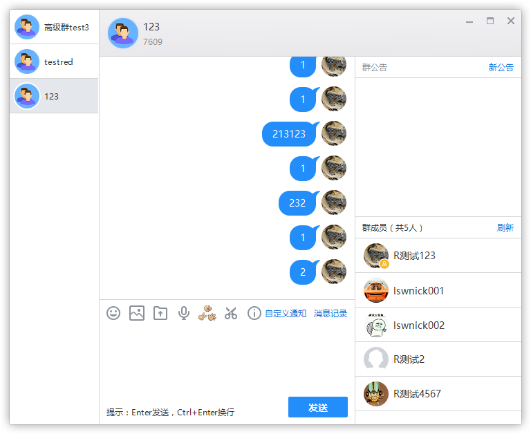

# 网易云信 多窗口合并功能升级说明

## <span id="云信多窗口合并功能简介">云信多窗口合并功能简介</span>

根据一些客户反映的需求，一些情况下会话窗口过多时导致界面比较混乱，为了方便管理多个会话窗口的显示效果，希望增加多会话窗口合并功能。现在已经增加了该功能，但是由于代码改动较大，为了帮助使用旧版本PC Demo的客户顺利增加多窗口合并功能，特意写下升级说明，说明如何在旧代码的基础上增加多窗口合并功能。


## <span id="多窗口合并功能结构">多窗口合并功能结构</span>

在旧版本的结构里，一会会话窗口代表一个唯一的会话(P2P或群组会话)，与这个会话相关的功能和事件回调都与这个会话窗口绑定在一起。会话窗口对应的XML包含了会话需要的控件信息。也就是会话与会话窗口是对应的关系。

而新版本的结构，为了多窗口合并的需求，一个窗口里面可以容纳下多个会话。这也就导致了许多代码需要改变，不能把会话相关的功能与窗口绑定在一起。现在会话窗口与会话是包含关系。现在把会话窗口与会话拆分为两部分：会话盒子、会话窗口。一个会话的界面内容称之为`会话盒子`，一个会话窗口可以包含多个`会话盒子`。

在旧版本里，会话功能对应的类为`SessionForm`，父类是`WindowEx`；而在新版本里，把会话功能对应的类为`SessionBox`（会话盒子），父类为`VBox`，会话窗口对应的类为`SessionForm`，父类是`WindowEx`。旧版本的`SessionForm`功能都修改到`SessionBox`，而新版的`SessionForm`几乎不包含会话相关的功能，新版的`SessionForm`作为`SessionBox`的容器来管理和维护`SessionBox`。

## <span id="需要修改的代码">需要修改的代码</span>

1. UIKIT下原本所有使用`SessionForm`类的代码全部替换为`SessionBox`，这个可以使用全局替换功能
2. `SessionManager::GetInstance()->Find()`改名为`SessionManager::GetInstance()->FindSessionBox()`
3. 原本使用`WindowsManager::GetInstance()->GetWindow()`方法查找会话窗口的代码全部改成`SessionManager::GetInstance()->FindSessionBox()`来查找。这个很重要，因为现在的SessionForm已经不具备会话相关的功能了。

4. `SessionManager::GetInstance()->OpenSessionForm()`改名为`SessionManager::GetInstance()->OpenSessionBox()`
5. `SessionBox`类继承`VBox`类
6. `SessionBox`类增加`SetSessionForm`、`GetSessionForm`方法
7. `SessionBox`类的`InitWindow`方法改为`InitSessionBox`方法
8. `SessionBox`类的`OnFinalMessage`方法改为`UninitSessionBox`方法
9. `SessionBox`类中关于需要使用窗体句柄的地方重新修改
10. `SessionBox`类中关于`修改窗口标题`、`修改窗口任务栏图标`、`闪动任务栏`、`修改窗口尺寸`等与窗口有关的操作都要传递给`SessionForm`去做

## <span id="需要改动的文件">需要改动的文件</span>
其中改动最多的代码其中在:
`tool_kits\ui_component\ui_kit\gui\session`目录下session_form开头的文件
`tool_kits\ui_component\ui_kit\gui\session`目录下session_box开头的文件
`tool_kits\ui_component\ui_kit\module\session`目录下session_manager开头的文件

### <span id="Duilib增加的文件">Duilib增加的文件</span>
`云信Duilib`修改了`Control`、`Window`、`RichEdit`组件
其中`Control`增加了`DetachEvent`方法，用于释放某个事件对应的的消息处理器
`RichEdit`重写了了`SetWindow`方法，用于重新注册RichEdit所属的窗口

### <span id="UIKIT增加的文件">UIKIT增加的文件</span>
1. 在`tool_kits\ui_component\ui_kit\module\dragdrop`目录中增加`drag_drop.h`、`drag_drop.cpp`文件
2. 在`tool_kits\ui_component\ui_kit\gui\session\dragdrop`目录中增加`drag_form.h`、`drag_form.cpp`、`bitmap_control.cpp`、`bitmap_control.cpp`文件
3. 在`tool_kits\ui_component\ui_kit\gui\session\control`目录中增加`merge_item.h`、`merge_item.cpp`文件
4. `tool_kits\ui_component\ui_kit\gui\session`目录中的原`session_form`开头的文件改为`session_box`开头
5. 在`tool_kits\ui_component\ui_kit\gui\session`目录中增加`session_form.h`、`session_form.cpp`、`session_form_dragdrop.cpp`文件

### <span id="XML增加的文件">XML增加的文件</span>
在`bin\themes\default\session`目录中增加了`drag_form.xml`、`merge_item.xml`、`session_form.xml`
把原本的`session.xml`改为`session_box.xml`
`session_box.xml`中的名为`closebtn`和`minbtn`的按钮改名为`btn_close`和`btn_min`

## <span id="开启或关闭多窗口合并功能">开启或关闭多窗口合并功能</span>

`tool_kits\ui_component\ui_kit\export`目录中的nim_ui_session_manager.h文件对应`uikit`导出的`SessionManager`类，其中新增了`SetEnableMerge`、`IsEnableMerge`、`SetUseCustomDragImage`、`IsUseCustomDragImage`等函数。

通过调用`SetEnableMerge`函数可以开启或者关闭多窗口合并功能，默认为开启。如果关闭了多窗口合并功能，那么会话窗口的行为和外观就和老版本的一致了。

示例代码如下：

```
nim_ui::SessionManager::GetInstance()->SetEnableMerge(false);
```

## <span id="多窗口合并功能注意点">多窗口合并功能注意点</span>

在拖拽会话盒子时，会出现一个拖拽的缩略图效果。这个缩略图的实现方法有两个：
1. 使用系统的拖拽效果接口，好处是兼容性好；缺点是如果拖拽到其他程序的窗口上，如果对方窗口不支持拖入，那么拖拽效果图就会消失，影响外观。
2. 使用自定的拖拽效果接口，好处是在任何情况下都可以顺利显示拖拽效果，并且可以通过修改代码自定义拖拽的效果；缺点是拖拽的实现用到了低级键盘钩子，一些安全软件会拦截我们的程序，如果使用自定义拖拽效果需要申请去对应的安全软件里申请白名单。

默认情况下开启了自定义拖拽效果，开启或关闭自定义拖拽效果示例如下代码如下：

```
nim_ui::SessionManager::GetInstance()->SetUseCustomDragImage(false);
```